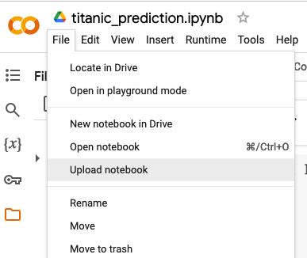
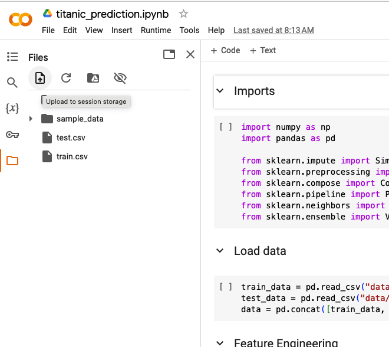
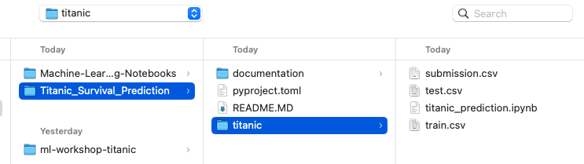

# Titanic Survival Prediction

## Introduction

This repository contains a jupyter notebook with code required to create models to predict the survival of passengers on the Titanic. The data used for this project is from the [Kaggle Titanic Competition](https://www.kaggle.com/c/titanic).

## Goal

The goal of this project is to create a model that accurately predicts who survives. The accuracy is the percentage of passengers that are correctly predicted to have survived.

## Setup
1) Clone this repository: `$ git clone https://github.com/Eliassoren/Titanic_Survival_Prediction.git` to your machine or just download the files.
2) Go to Google Colab in your browser: https://colab.research.google.com

3) Select file > Upload notebook. Upload `titanic_prediction.ipynb` which is found under /titanic

4) Now you need data. Select the Files icon in the left menu and click "upload to session storage". Choose train.csv, test.csv and submission.csv from /titanic.

## Learn

Click play to run code in cells. 
